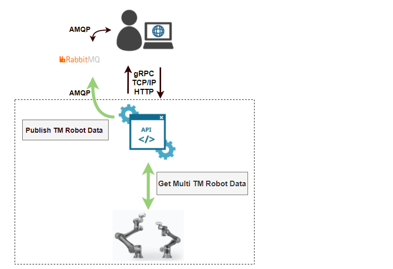

## What is Robot Management API

### Basic Version

TM Robot Management API Basic 讓客戶可以在自己的設備管理系統、物聯網管理系統，連結多台 TM Robot 以進行數據監控

#### Features：

1. 掌握多台手臂數據
2. 支援 HMI 版本 1.72, 1.76, 1.80, 1.82
3. 提供多種程式通訊接口 (gRPC 即將釋出)
4. 支援 Windows / Linux

| No. | System Requirement        | Socket API         | Web API            | Grpc API           | Rabbit-MQ          |
| --- | ------------------------- | ------------------ | ------------------ | ------------------ | ------------------ |
| 1   | 連線手臂                  | :heavy_check_mark: | :heavy_check_mark: | :heavy_check_mark: | :heavy_check_mark: |
| 2   | 取得手臂資訊              | :heavy_check_mark: | :heavy_check_mark: | :heavy_check_mark: | :heavy_minus_sign: |
| 3   | 取得手臂專案清單          | :heavy_check_mark: | :heavy_check_mark: | :heavy_check_mark: | :heavy_minus_sign: |
| 4   | 取得手臂 VarSync 變數清單 | :heavy_check_mark: | :heavy_check_mark: | :heavy_check_mark: | :heavy_minus_sign: |
| 5   | 取得手臂變數值            | :heavy_check_mark: | :heavy_check_mark: | :heavy_check_mark: | :heavy_minus_sign: |
| 6   | 取得 Modbus               | :heavy_check_mark: | :heavy_check_mark: | :heavy_check_mark: | :heavy_minus_sign: |
| 8   | 訂閱手臂資訊              | :heavy_check_mark: | :heavy_minus_sign: | :heavy_minus_sign: | :heavy_check_mark: |
| 9   | 取消訂閱手臂資訊          | :heavy_check_mark: | :heavy_minus_sign: | :heavy_minus_sign: | :heavy_check_mark: |
| 10  | 訂閱手臂變數              | :heavy_check_mark: | :heavy_minus_sign: | :heavy_minus_sign: | :heavy_check_mark: |
| 11  | 取消訂閱手臂變數          | :heavy_check_mark: | :heavy_minus_sign: | :heavy_minus_sign: | :heavy_check_mark: |
| 12  | 定時訂閱手臂資訊          | :heavy_minus_sign: | :heavy_minus_sign: | :heavy_minus_sign: | :heavy_check_mark: |
| 13  | 定時訂閱手臂變數資訊      | :heavy_minus_sign: | :heavy_minus_sign: | :heavy_minus_sign: | :heavy_check_mark: |

#### Not In Scope

| #   | Not in scope                                                                                                  |
| --- | ------------------------------------------------------------------------------------------------------------- |
| 1   | 若要使用 Robot Management API 進行: 取得專案清單、取得變數清單、VarSync 變數傳遞，則無法跟 TMmanager 軟體共用 |
| 2   | 不支援手臂控制功能                                                                                            |
