# Robot Management API User Guide

  * [Overview](#overview)
  * [TM Robot Setting](#tm-robot-setting)
  * [Start Robot Management API](#start-robot-management-api)
    + [Static IP Address Requirements](#static-ip-address-requirements)
    + [Linux](#linux)
    + [Windows](#windows)
  * [RabbitMQ Setting](#rabbitmq-setting)
    + [Linux](#linux-1)
    + [Windows](#windows-1)
  * [Client Application Started](#client-application-started)
    + [Socket API](#socket-api)
    + [WebAPI](#webapi)
    + [RabbitMQ Client](#rabbitmq-client)
+ [Log Files](#log-files)

## Overview

Robot Management API 是一款提供給系統開發人員整合 TM Robot 的 API 服務，支援通訊協議有 TCP/IP、HTTP、RabbitMQ，提供對應 API 方式有 Socket API、WebAPI、RabbitMQ Client 以便用戶應用程式使用並取得多台連線中的手臂資料，同時也允許多個 Clients 連線 Robot Management API。

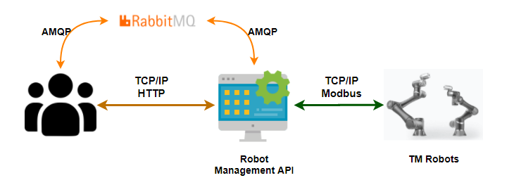

## TM Robot Setting

-   Modbus 用網路卡設置 static IP address

-   開啟 Modbus 功能

-   開啟 TMmanager 功能並完成設定

    | IP address                   | Port |
    | ---------------------------- | ---- |
    | Robot Management API 主機 IP | 9835 |


## Start Robot Management API

### Static IP Address Requirements

1. Robot Management API 服務執行用主機

   Robot Management API 依 Client - Server 架構作為 Server，提供用戶端應用程式呼叫 API 方法。同時也提供 TM Robot Socket Client 主動連線使用。

2. TM Robot Modbus 用網路卡

   TM Robot 依 Master - Slave 架構提供 Robot Management API 取得 Modbus TCP 資料，因此 TM Robot 需透過 HMI 設置 Modbus 網路卡為固定 IP。

### Linux 

- (Preferred) Ubuntu Bionic 18.04 (LTS)
- 安裝 Docker - 請參閱 [Install Docker Engine on Ubuntu](https://docs.docker.com/engine/install/ubuntu/) 
- 安裝 Docker Compose - 請參閱 [Install Docker Compose](https://docs.docker.com/compose/install/)

**Start via Docker**

1. 建立服務資料夾，新增 docker-compose.yml 檔案
   
   ```bash
   mkdir robot-management-api
   cd robot-management-api
   touch docker-compose.yml
   ```
   
2. 請複製 docker-compose.yml 範例並在 `volumns` 下修改 Log 存放路徑，如要開啟 RabbitMQ 功能請[參考](#rabbitmq-setting)

   ```yaml
   version: '3'
   services:
     ServiceEngineCore:
       image: techmanrobotinc/tmrobot-mgt-api:latest
       container_name: "robot-api"
       network_mode: "host"
       environment:
         _ENVIRONMENT: "production"
         _USERINFO: "[{\"UserName\": \"Admin\",\"Password\": \"admin\"}]"
       volumes:
         - /home/username/docker-examples:/app/Log
   ```
> volumes 請自行修改 /home/username/docker-examples

3. 於 docker-compose.yml 自行調整`_USERINFO`，其帳號密碼將用來取得存取 Token

   | 變數名稱 | 變數值              |
   | -------- | ------------------- |
   | UserName | 使用者帳號(自定義)  |
   | Password | 使用者密碼 (自定義) |

5. 於 robot-management-api  資料夾 (即 docker-compose.yml 所在資料夾) 開啟終端機並下執行建置指令，如不想要背景執行則移除下面`-d`

   ```bash
   sudo docker-compose up -d
   ```

5. 開啟 URL [http://{server_ip}:9832/HttpServer/TestRobotApiConnect](http://{server_ip}:9832/HttpServer/TestRobotApiConnect) 得到 "Connection true"代表 Robot Management API 服務啟動成功

   >請自行更改 {server_ip}

### Windows 

-   Windows 10 64-bit: Pro, Enterprise, or Education (Build 16299 or later).
-   ASP.NET Core Runtime 3.1.0
  
    - 請至 Microsoft .NET 進行 [下載安裝](https://dotnet.microsoft.com/download/dotnet-core/3.1) 
    

**Start**

1. 請洽詢 [Techman Robot](https://www.tm-robot.com/en/contact-us/) 技術支援下載 Robot Management API

2. 進入RobotManagementAPI資料夾

3. 打開 appsetting.json 自行調整`_USERINFO`，其帳號密碼將用來取得存取 Token

   ```json
   {
         "_USERINFO": "[{\"UserName\": \"Admin\",\"Password\": \"admin\"}]"
   }
   ```

   | 變數名稱 | 說明                |
   | -------- | ------------------- |
   | UserName | 使用者帳號          |
   | Password | 使用者密碼 (自定義) |

5. 如要開啟 RabbitMQ 功能請[參考](#rabbitmq-setting)

5. 執行 Robot Management API 服務

6. 開啟 URL [http://{server_ip}:9832/HttpServer/TestRobotApiConnect](http://{server_ip}:9832/HttpServer/TestRobotApiConnect) 得到 "Connection true"代表 Robot Management API 服務啟動成功

   > 請自行更改 {server_ip}

## RabbitMQ Setting

Robot Management API 設定檔均提供 `_RABBITMQSETTING`環境變數以設置 RabbitMQ 功能，欄位說明如下

| 變數名稱             | 說明                  |
| -------------------- | --------------------- |
| IP                   | Rabbit MQ Server IP   |
| Port                 | Rabbit MQ Server Port |
| UserName             | Rabbit MQ 使用者帳號  |
| Password             | Rabbit MQ 使用者密碼  |
| VHost                | RabbitMQ 虛擬主機名稱 |
| Exchange             | RabbitMQ 交換機名稱   |
| TMRobotInfoRoute     | Routing key 手臂資料  |
| TMRobotVariableRoute | Routing key 手臂變數  |

### Linux

開啟 RabbitMQ 功能需在 docker-compose.yml 檔案的 `environment` 再新增 `_RABBITMQSETTING` 變數，其設定值根據上面欄位說明以 JSON 格式填寫

```yaml
environment:
  _RABBITMQSETTIMG: "{
    \"IP\":\"127.0.0.1\",
    \"Port\":5672,
    \"UserName\":\"Test\",
    \"Password\":\"Test\",
    \"VHost\":\"/\",\"Exchange\":\"Topic\",
    \"TMRobotInfoRoute\":\"test.queue.1\",
    \"TMRobotVariableRoute\":\"test.queue.2\"
}"
```
### Windows 

appsetting.json 再新增 `_RABBITMQSETTIMG` 屬性，其設定值根據上面欄位說明以 JSON 格式填寫
```json
{
  "_RABBITMQSETTIMG": "{\"IP\":\"127.0.0.1\",\"Port\":5672,\"UserName\":\"Test\",\"Password\":\"Test\",\"VHost\":\"/\",\"Exchange\":\"Topic\",\"TMRobotInfoRoute\":\"test.queue.1\",\"TMRobotVariableRoute\":\"test.queue.2\"}"
}
```

## Client Application Started

以下使用 [JMeter](https://jmeter.apache.org/) 模擬 Client Application 發送請求並得到回覆的結果

更多 API 方法內容請參閱 [(basic)documentation](https://devops.tm-robot.com:2443/tm-internal/project-docs/-/blob/master/robot-api/robot-api-documentation_basic_.md)

### Socket API

1. Get Authorization Token 取得存取 Token
   - Request
   
     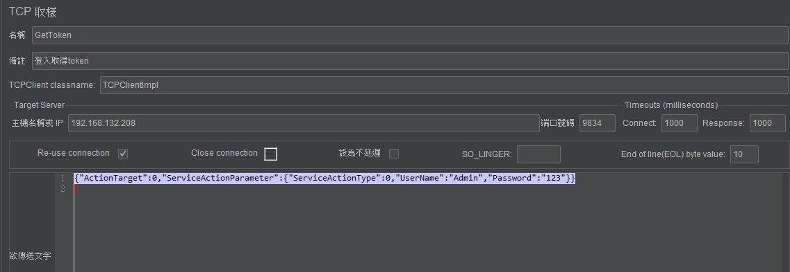
   
   - Response
   
     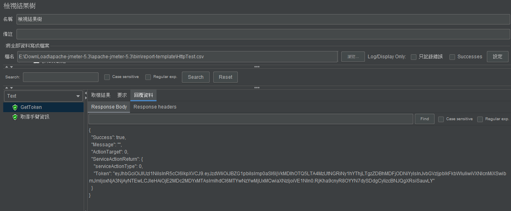
   
2. Get Robot Information 取得手臂資訊
   - Request
   
     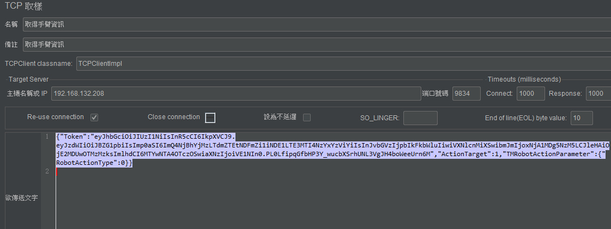
   
   - Response
   
     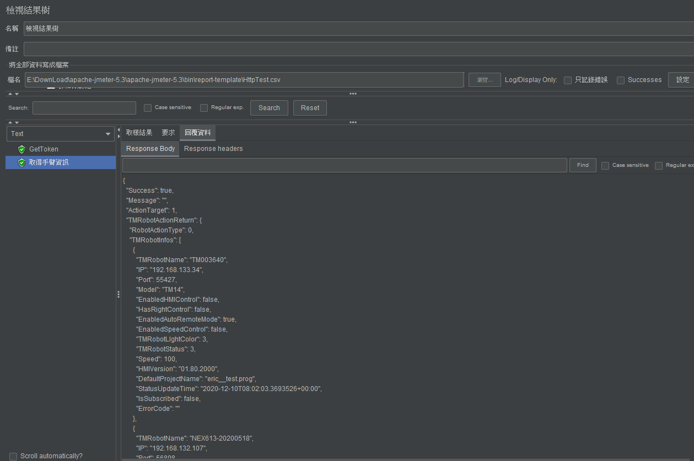

### WebAPI

1. Get Authorization Token 取得存取 Token
   - Request
   
     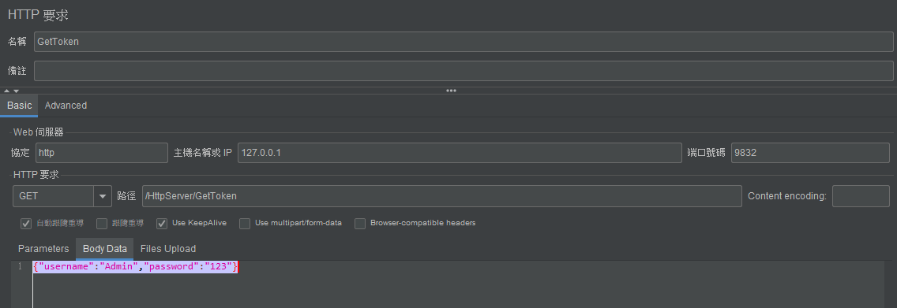
   
   - Response
   
     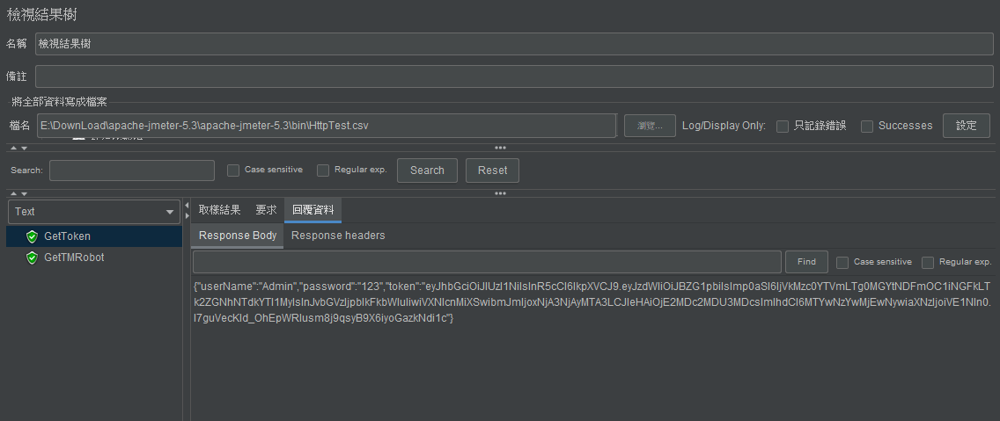
   
2. Get Robot Information 取得手臂資訊
   - Request Header
   
     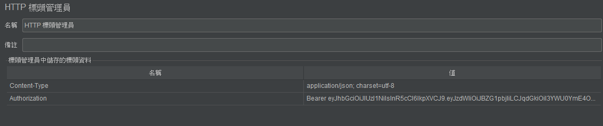
   
   - Request Body
   
     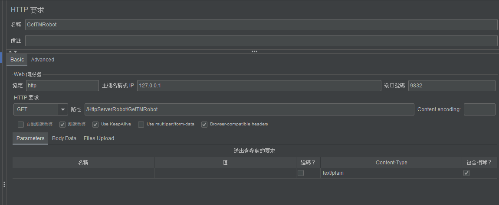
   
   - Response
   
     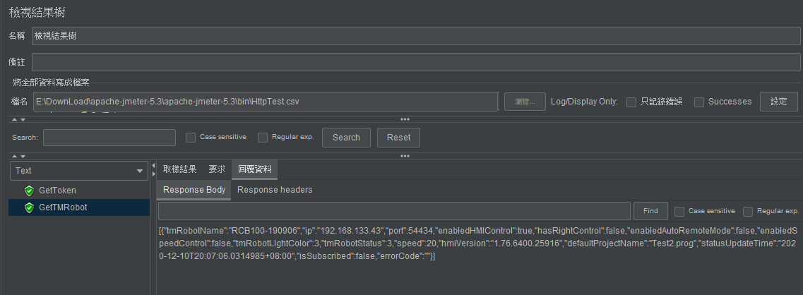

### RabbitMQ Client

當Robot Management API 執行起來後，便已開始執行 RabbitMQ Client 功能，並且在連線 TM Robot 後，主動 Publish 手臂資訊以及變數資訊至 RabbitMQ Server，收到資料結果畫面示範如下

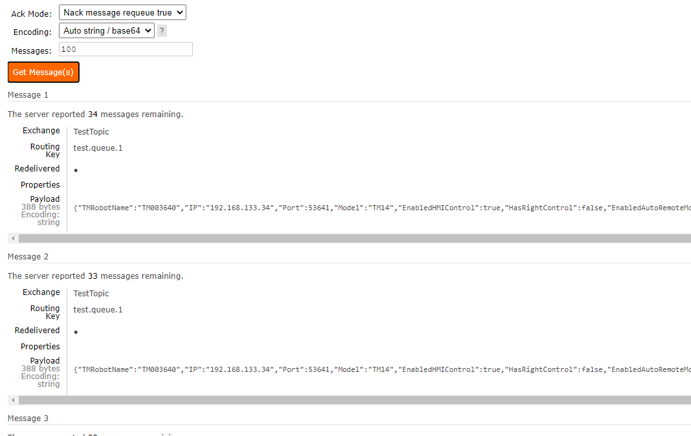
   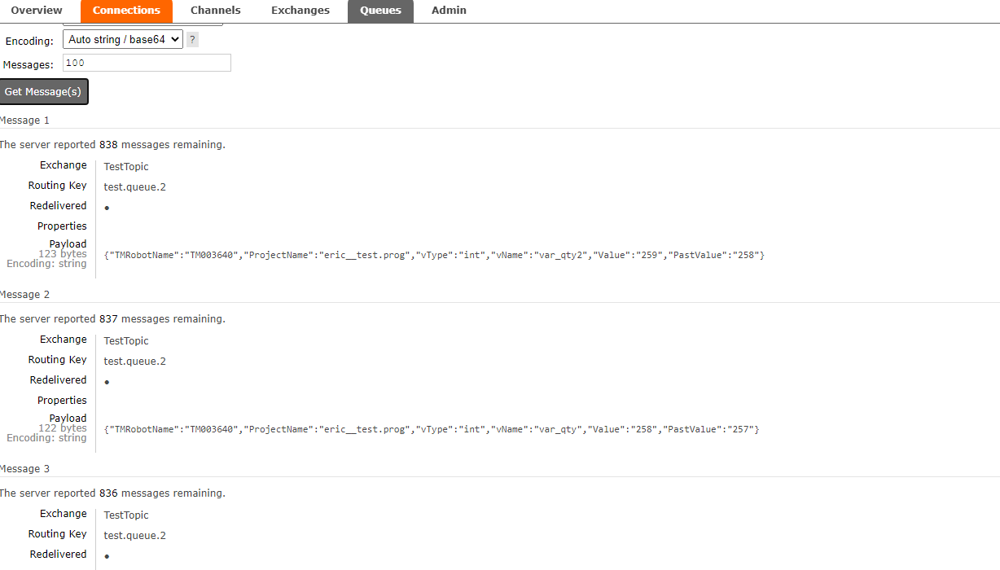

## Log Files

Robot Management API 運行中，執行資訊或相關錯誤資訊將紀錄在 Log 

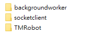

若使用遇到問題需要技術性排查，可再提供 Robot Management API 紀錄 Log 給 [Techman Robot](https://www.tm-robot.com/en/contact-us/)

### Linux

Log 位址依 docker-conmpose.yml 設定路徑

```yaml
volumes:
	- /home/username/docker-examples:/app/Log
```

### Windows

Log 位址將在 Robot Management API 執行資料夾位置